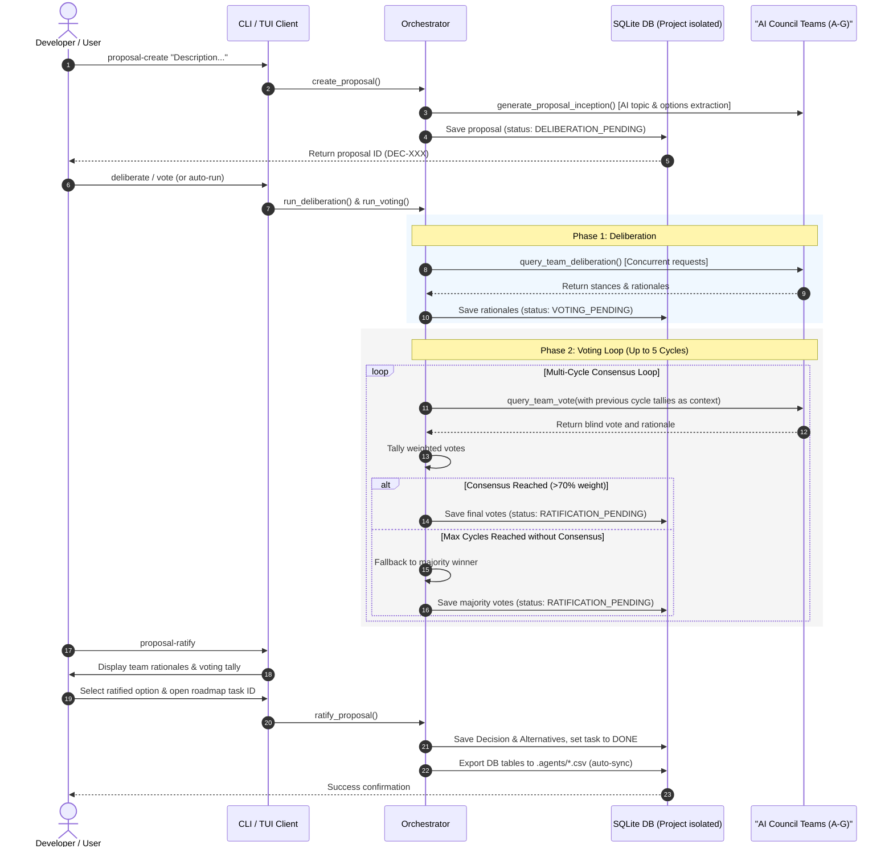

# Council Manager

**v0.8.1** — A Python-based, multi-team AI project governance orchestrator. Council Manager enables collaborative decision-making, blind voting, structured project audits, and real-time monitoring across multiple isolated workspaces.

See the [CHANGELOG.md](./CHANGELOG.md) for version release details.

---

## Architecture Overview

The system is designed around a decoupled **Ports & Adapters (Hexagonal)** architecture, keeping configuration, database engines, orchestration, and user interfaces separated by explicit input/output boundaries.

*   **Subsystem & Component Boundaries**: Detailed in [use_case_planning.md](file:///C:/Users/sulig/.gemini/antigravity-cli/brain/3ee7a652-e3b9-4285-aa73-cc8ce7ebaa96/use_case_planning.md).
*   **Use Cases Diagram**: [use_cases.puml](file:///B:/projects/council_manager/uml/use_cases.puml).
*   **Component Diagram**: [components.puml](file:///B:/projects/council_manager/uml/components.puml).

### Governance Orchestration Lifecycle



Detailed class and sequence diagrams mapping the implementation logic of these modules can be found under the [uml/sequences/](file:///B:/projects/council_manager/uml/sequences/) directory.


---

## Installation & Setup

Ensure you have [uv](https://github.com/astral-sh/uv) installed in your environment.

1.  **Clone the workspace** and navigate to the project root:
    ```bash
    cd B:/projects/council_manager
    ```
2.  **Install dependencies** and create the virtual environment:
    ```bash
    uv sync
    ```
3.  **Configure Environment Variables**:
    Create a `.env` file in the project root (you can copy the template from `.env.example`):
    ```bash
    cp .env.example .env
    ```
    Open `.env` and set your `GEMINI_API_KEY`:
    ```env
    GEMINI_API_KEY=your-actual-api-key
    ```
    *(Optional)* You can also change the target model by setting `LLM_MODEL`, `OLLAMA_MODEL`, or `GEMINI_MODEL`. If you experience high demand (503) or rate limits on the default model, you can try setting it to a different supported model (e.g. `gemini-3.5-pro` or `gemini-3.5-flash`).

    *(Optional)* **Swappable LLM Providers (Local Ollama / OpenAI)**:
    To bypass rate limits or run offline, configure a custom provider:
    ```env
    LLM_PROVIDER=ollama
    # Default URL is http://localhost:11434/v1
    LLM_API_BASE=http://localhost:11434/v1
    # Swapped model name matching your local library (LLM_MODEL or OLLAMA_MODEL)
    LLM_MODEL=llama3
    ```

---

## Running Tests

Verify the database models, session routing, and migration logic by executing the test suite:

```bash
uv run pytest
```

---

## Manual Testing & Developer Usage

### 1. Database Session Management
The database layer isolates data per workspace by creating a dedicated SQLite file inside the user's home directory (specifically `~/.gemini/council_manager/governance_<slug>.db`), keeping the git repository clean of binary database files. This default path can be overridden by setting the `COUNCIL_DATABASE_DIR` environment variable.

To retrieve a database session for a specific project directory:
```python
from pathlib import Path
from council_manager.db import db_manager, Project

# Resolve the target project directory
workspace_path = Path("B:/projects/council_manager")

# Retrieve an isolated SQLAlchemy session
session = db_manager.get_session(workspace_path)
try:
    # Query or insert data
    project = session.query(Project).filter_by(id="council_manager").first()
    print(f"Project Name: {project.name if project else 'Not Found'}")
finally:
    session.close()
    
    # Release file locks (critical on Windows when cleaning up database resources)
    db_manager.close_all()
```

### 2. Running CSV Import/Export Migration
To bridge flat CSV governance logs into the SQLite database, or dump tables back to CSVs:

```python
from pathlib import Path
from council_manager.db import import_csv_to_db, export_db_to_csv

workspace_path = Path("B:/projects/council_manager")

# Import all CSVs (.agents/*.csv) into the new SQLite database
import_csv_to_db(workspace_path, "council_manager")

# Export database tables back into semi-colon CSVs (.agents/*.csv)
export_db_to_csv(workspace_path, "council_manager")
```

### 3. Orchestration & 5-Cycle Voting

The `CouncilOrchestrator` manages the lifecycle of proposals through deliberation and consensus voting.

#### A. Initializing a Proposal
Initialize a proposal and persist it within the isolated SQLite database:

```python
from pathlib import Path
from council_manager.core.orchestrator import council_orchestrator

workspace = Path("B:/projects/council_manager")

proposal = council_orchestrator.create_proposal(
    workspace_dir=workspace,
    project_id="council_manager",
    proposal_id="DEC-072",
    topic="Voting Subsystem Strategy",
    description="Adopt 5-cycle autonomous AI voting with final human ratification.",
    options=[
        "Alt 1: Pre-Voted and Fallback Override",
        "Alt 2: Interactive Round-by-Round",
        "Alt 3: Autonomous AI with User Ratification"
    ]
)
print(f"Proposal '{proposal.id}' created. Status: {proposal.status}")
```

#### B. Asynchronous Deliberation (Phase 1)
Run Phase 1 to collect engineering paradigm rationales from all active teams concurrently:

```python
import asyncio
from pathlib import Path
from council_manager.core.orchestrator import council_orchestrator

workspace = Path("B:/projects/council_manager")

async def run_phase1():
    proposal = await council_orchestrator.run_deliberation(workspace, "DEC-072")
    print(f"Deliberation complete. Status: {proposal.status}")
    print(f"Collected rationales: {proposal.rationales}")

asyncio.run(run_phase1())
```

#### C. Asynchronous 5-Cycle Voting Engine (Phase 2)
Conduct up to 5 cycles of consensus voting. In each cycle:
1.  **Blind Voting**: Teams cast secret, weighted votes concurrently using the official `google-genai` SDK.
2.  **Consensus Verification**: The engine tallies votes. If any option achieves **$\ge 70\%$** of the active weight, consensus is met and the loop terminates early.
3.  **Debate Feedback**: If no consensus is met, the engine feeds previous cycle vote distributions and justifications back to the team agents as context for the next cycle.
4.  **Fallback**: If no consensus is reached after 5 cycles, the engine falls back to selecting the option with the highest weighted majority.
5.  **User Ratification**: The final proposal is set to `RATIFICATION_PENDING` and awaits Approve/Reject signature from the user.

```python
import asyncio
from pathlib import Path
from council_manager.core.orchestrator import council_orchestrator

workspace = Path("B:/projects/council_manager")

async def run_phase2():
    proposal = await council_orchestrator.run_voting(workspace, "DEC-072", max_cycles=5)
    print(f"Voting complete. Final Status: {proposal.status}")
    print(f"Consensus Votes: {proposal.votes}")

asyncio.run(run_phase2())
```

---

## Command Line Interface (CLI) Usage

The system exposes a comprehensive CLI for managing projects, importing/exporting database states, and running deliberations/votes externally.

You can run the CLI tool using `uv run council-manager`:

```bash
uv run council-manager --help
```

### Key CLI Commands

1.  **Project Initialization & Onboarding**:
    Initialize a new isolated project space. You can supply a pre-defined domain-specific council template (`software`, `education`, `marketing`, `general`) or omit it to let the AI infer the optimal teams based on the project description:
    ```bash
    # Initialize using a software engineering template council
    uv run council-manager init-project --path <dir-path> --project-id <proj-id> --council-template software

    # Initialize and let the LLM infer the optimal team structures and member count from the description
    uv run council-manager init-project --path <dir-path> --project-id <proj-id> --description "A curriculum review pipeline for pedagogy."

    # Repair missing governance skill files in an already initialized project (without re-onboarding)
    uv run council-manager init-project --fix-missing --path <dir-path>
    ```
    *Onboarding generates:*
    *   `.agents/teams.csv` populated with the custom specialist teams.
    *   `.agents/skills/council-manager/SKILL.md` (the general tool compliance skill — enforces CLI-only encapsulation).
    *   `.agents/skills/project-council/SKILL.md` (the custom, project-specific agent persona instructions).
    *   `.agents/skills.json` (auto-registered paths mapping both skills).

2.  **Registering Agent Skills**:
    Generate or update the `skills.json` registration configuration on demand to expose local skills to the agent environment:
    ```bash
    uv run council-manager register-skill -w <workspace-dir>
    ```

3.  **CSV Import/Export Migrations**:
    ```bash
    uv run council-manager import -w <workspace-dir> -p <project-id>
    uv run council-manager export -w <workspace-dir> -p <project-id>
    ```
3.  **Proposal Creation** (with optional auto-inception, auto-deliberation, or auto-voting):
    ```bash
    # Create proposal (returns dynamic DEC-xxx ID)
    uv run council-manager proposal-create "Detailed description here" -w <workspace-dir>

    # Create and automatically trigger Phase 1 Deliberation immediately
    uv run council-manager proposal-create "Detailed description here" -w <workspace-dir> --deliberate

    # Create and automatically trigger both Deliberation and Phase 2 Consensus Voting
    uv run council-manager proposal-create "Detailed description here" -w <workspace-dir> --vote --max-cycles 5
    ```
4.  **Orchestrate Deliberations & Votes** (omitting `--proposal-id` automatically targets the latest created proposal):
    ```bash
    # Run Phase 1 Deliberation (add --async to run in the background as a task)
    uv run council-manager deliberate -w <workspace-dir> --proposal-id <id> [--async]
    uv run council-manager deliberate -w <workspace-dir>  # Targets the latest proposal

    # Run Phase 2 Consensus Voting Loop (add --async to run in the background as a task)
    uv run council-manager vote -w <workspace-dir> --proposal-id <id> --max-cycles 5 [--async]
    uv run council-manager vote -w <workspace-dir> --max-cycles 5  # Targets the latest proposal
    ```
5.  **Interactive Proposal Ratification Wizard**:
    Review voting rationales, select/ratify the final option, and complete the corresponding roadmap task in the database and CSV files:
    ```bash
    uv run council-manager proposal-ratify -w <workspace-dir> --proposal-id <id>
    uv run council-manager proposal-ratify -w <workspace-dir>  # Targets the latest proposal
    ```
6.  **Status & Log Inspection** (omitting `--proposal-id` targets the latest proposal):
    ```bash
    uv run council-manager list -w <workspace-dir>
    uv run council-manager show -w <workspace-dir> --proposal-id <id>
    uv run council-manager show -w <workspace-dir>  # Shows details of the latest proposal
    uv run council-manager show-teams -w <workspace-dir>
    uv run council-manager show-decisions -w <workspace-dir>
    uv run council-manager show-roadmap -w <workspace-dir>
    uv run council-manager show-audits -w <workspace-dir>

    # Check the execution status of a background task
    uv run council-manager task-status <task-id> -w <workspace-dir>

    # View or tail console logs of a background task
    uv run council-manager task-logs <task-id> -w <workspace-dir> [--tail]
    ```
7.  **Individual Team Deliberation & Voting** (omitting `--proposal-id` targets the latest proposal):
    ```bash
    uv run council-manager team-deliberate -w <workspace-dir> --team-id <team-id> --proposal-id <id>
    uv run council-manager team-deliberate -w <workspace-dir> --team-id <team-id>  # Targets latest proposal
    uv run council-manager team-vote -w <workspace-dir> --team-id <team-id> --proposal-id <id>
    uv run council-manager team-vote -w <workspace-dir> --team-id <team-id>  # Targets latest proposal
    ```
8.  **Starting the API Server** (serves REST API, WebSocket events, and Web UI dashboard):
    ```bash
    uv run council-manager start-server --host 127.0.0.1 --port 8000 --reload
    # On startup, the CLI will print the dashboard URL:
    # Web UI Dashboard: http://127.0.0.1:8000/dashboard
    # API Docs (Swagger): http://127.0.0.1:8000/docs
    ```
9.  **Interactive Terminal UI Dashboard** (local TUI — no server required):
    ```bash
    uv run council-manager dashboard [-w <workspace-dir>]
    ```

---

## FastAPI API Backend Server

The orchestrator includes a FastAPI-based backend server that supports dynamic multi-tenant database routing and optionally secured endpoints.

### Running the Server
You can launch the server via the CLI subcommand:
```bash
uv run council-manager start-server [--host <host>] [--port <port>] [--reload]
```

### Authorization & Security
Endpoints can be secured by setting the `COUNCIL_API_KEY` environment variable. When configured, all requests to the server (except `/health`) must include the API key in the `X-API-Key` header.

### Multi-Tenant Database Routing
The server dynamically routes database connections to isolated SQLite files based on the client workspace path or project slug. Requests can provide either the absolute path, a project slug, or omit headers to automatically resolve to the uvicorn process's working directory:
*   Header: `X-Project-ID` (e.g. `council_manager` or a mapped custom slug)
*   Header: `X-Workspace-Path` (e.g. `/absolute/path/to/workspace`)
*   If both headers are omitted, the server automatically resolves database connections to the server process's configured workspace directory (`settings.workspace_dir`).

Logical project-to-workspace path mappings can be registered via the `workspace_mappings` configuration setting (e.g. `COUNCIL_WORKSPACE_MAPPINGS='{"my_project": "B:/projects/my_project"}'`).

### Key Endpoints
*   `GET /health`: Health check verification (does not require auth or workspace headers).
*   `GET /` or `GET /dashboard`: Serve the real-time Web UI dashboard (HTML/CSS/JS single-page application).
*   `GET /proposals`: Retrieve a list of all proposals.
*   `GET /proposals/{proposal_id}`: Retrieve details for a specific proposal.
*   `POST /proposals`: Create a new proposal.
*   `POST /proposals/{proposal_id}/deliberate`: Queue Phase 1 Deliberation in the background (default `async_mode=true`) or run synchronously.
*   `POST /proposals/{proposal_id}/vote`: Queue Phase 2 Consensus Voting loop in the background (default `async_mode=true`) or run synchronously.
*   `GET /tasks/{task_id}/status`: Query execution status of a background task.
*   `GET /tasks/{task_id}/logs`: Retrieve log output content of a background task worker.
*   `POST /tasks/{task_id}/events`: Ingest a progress event from a background task worker and broadcast it to all connected WebSocket clients.
*   `GET /decisions`: Retrieve ratified decisions.
*   `GET /roadmap`: Retrieve project roadmap task statuses.
*   `GET /audits`: Retrieve history of quality alignment audits.

### WebSocket Endpoint
*   `WS /ws/workspace?path=<workspace-path>`: Establish a persistent WebSocket connection for a workspace. The server broadcasts real-time deliberation and voting progress events to all connected clients scoped to the same workspace path.

---

## Real-Time Web UI Dashboard

The server (`start-server`) now serves a fully integrated browser-based real-time dashboard at `http://localhost:8000/dashboard`. No external SPA framework is required — the dashboard is a self-contained HTML/CSS/JS file served statically by FastAPI.

To access the Web UI dashboard:
1. Start the API server: `uv run council-manager start-server`
2. Open your browser and navigate to: `http://127.0.0.1:8000/dashboard`
3. Enter your workspace path in the connection field and click **Connect**.

### Web Dashboard Features
*   **Live Workspace Connection**: Connect to any initialized workspace by its absolute path. The dashboard opens a persistent WebSocket connection (`/ws/workspace`) to receive server-pushed events.
*   **Specialist Council Grid**: Animated cards display all active Teams (A–G) with real-time status indicators showing which team is currently deliberating.
*   **Voting Tally Gauges**: Visual consensus gauges update in real-time after each voting cycle, showing weighted vote distributions per option.
*   **Server Console Log**: A scrolling console panel streams all deliberation and voting progress events from background worker tasks.
*   **Action Buttons**: Trigger Deliberate and Vote cycles directly from the browser client.

---

## Terminal User Interface (TUI) Dashboard

For local terminal-first workflows (no server required), the orchestrator includes a terminal-based dashboard UI built with [Textual](https://github.com/Textualize/textual) and [Rich](https://github.com/Textualize/rich).

To launch the interactive TUI dashboard:
```bash
uv run council-manager dashboard
```

### TUI Dashboard Features
*   **Proposals Tab**: Inspect proposals in real-time, view detailed agent deliberation justifications, see voting tallies, and run deliberations or voting loops directly via async worker threads in the terminal with live status toasts.
*   **Ratified Decisions Tab**: Browse immutable ratified architectural decisions and review alternatives compared (with Pros and Cons comparison blocks).
*   **Roadmap Tasks Tab**: View project roadmap milestones, notes, and task completion percentages via a visual progress bar.
*   **Compliance Audits Tab**: Review historical alignment audits and auditor details in a structured table.

---

## Development Roadmap

The development progress is tracked dynamically inside [roadmap.csv](file:///B:/projects/council_manager/.agents/roadmap.csv). Below is the authoritative outline of milestones:

### Phase 1: Database & Persistence Layer (Completed)
*   **`P1-01`**: Database Layer Initialization (SQLAlchemy - Unified SQLite)
*   **`P1-02`**: Project Isolation Logic (Tenant-style workspace separation)
*   **`P1-03`**: Governance CSV Import/Export Migration Tools

### Phase 2: Deliberation & Voting Core (Completed)
*   **`P2-01a`**: AI Team Agent Prompter & Agent Registry
*   **`P2-01b`**: Deliberation Engine (Phase 1 concurrent justifications)
*   **`P2-01c`**: Blind Voting Engine (Phase 2 concurrent anonymous votes)
*   **`P2-01d`**: Weighted Tally & Consensus Verifier (Consensus loop & fallback)
*   **`P2-01e`**: Token Safeguards & Caching Implementation (Ollama/OpenAI support)
*   **`P2-01f`**: Database Roadmap Table & Sync Integration
*   **`P2-01g`**: AI-Powered Proposal Inception (Topic & options extraction)
*   **`P2-02a`**: Asynchronous Task Orchestrator (Asyncio queue)
*   **`P2-02b`**: Task Status Query & CLI Logging

### Phase 3: APIs & User Interface (Completed)
*   **`P3-01a`**: FastAPI Server Setup & Endpoints
*   **`P3-01b`**: Authentication & Dynamic Database Routing Middleware
*   **`P3-02a`**: Interactive Terminal UI (TUI) Dashboard
*   **`P3-02b`**: TUI Dashboard Client Integration
*   **`P3-02c`**: Deliberation Progress & Timing Feedback (Indicators in CLI/TUI)

### Phase 4: Onboarding, Audits & Alignment (Completed)
*   **`P4-01`**: Update README.md Documentation
*   **`P4-02`**: CLI Command Inspection & Alignment
*   **`P4-03a`**: Interactive/Config Project Onboarding (Global member count suggestion)
*   **`P4-03b`**: Immediate Description Ratification (Auto-ratify initial project description as DEC-001)
*   **`P4-04`**: Phase 4 Alignment Audit (Compliance check)
*   **`P4-05`**: Minor Version Bump to 0.7.0 (Release version setup)

### Phase 5: Local Agent Skills Adapter (Completed)
*   **`P5-01`**: Create and Publish Local Agent Skill Integration Adapter (Register `council-manager` skill adapter)
*   **`P5-02`**: Implement Project-Specific Council Generation and Skill Customization (Generate custom `teams.csv` and bespoke agent skill based on project domain/description)

### Phase 6: Real-Time Extensions (In Progress — `feature/phase-6-extensions`)
*   **`P6-01`**: Real-Time WebSocket Web UI Dashboard (Browser-based SPA served by FastAPI with workspace-isolated WebSocket events) ✅
*   **`P6-02`**: Automated Commit Compliance Checks (Planned)
*   **`P6-03`**: JWT Authentication Layer (Planned)
*   **`P6-04`**: Multi-Tenant Server Enhancements (Planned)
