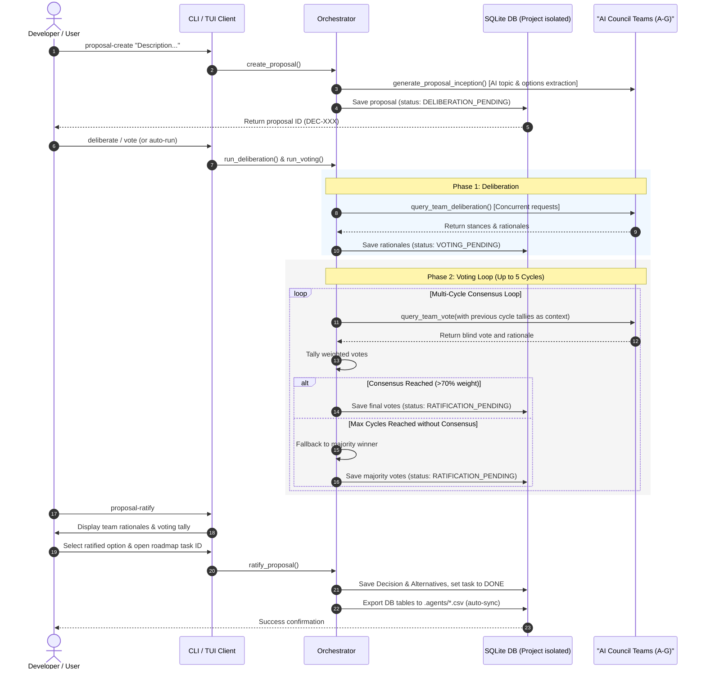

# Council Manager

**v0.9.2** — A Python-based, multi-team AI project governance orchestrator. Council Manager enables collaborative decision-making, blind voting, structured project audits, and real-time monitoring across multiple isolated workspaces.

See [CHANGELOG.md](./CHANGELOG.md) for version release details.

---

## 🚀 Quick Start: Installation & Setup

You can use Council Manager either as a **standalone tool** (cloned locally) or **installed directly into any external Python project**.

---

### Method 1: Installing into External Projects (Direct via Git)

To add governance tools directly into any external project workspace:

#### Using `pip` directly from Git:
```bash
pip install git+https://github.com/suli-g/council-manager.git
```

#### Using `uv` in an external project:
```bash
uv add git+https://github.com/suli-g/council-manager.git
```

#### Global CLI Installation via `uv tool`:
```bash
uv tool install git+https://github.com/suli-g/council-manager.git
```

Once installed externally, run governance commands in **any target project directory** using the `-w` (workspace) parameter:
```bash
# Initialize governance in your target project directory
council-manager get-context -w /path/to/target/project
```

---

### Method 2: Standalone Local Clone

#### 1. Clone the Repository
```bash
git clone https://github.com/suli-g/council-manager.git
cd council_manager
```

#### 2. Install Dependencies

##### Option A: Using `uv` (Recommended)
```bash
uv sync
```

##### Option B: Using standard `pip`
```bash
# Create and activate a virtual environment
python -m venv .venv
source .venv/bin/activate  # On Windows: .venv\Scripts\activate

# Install dependencies in editable mode
pip install -e .
```

---

### Environment Configuration
Copy `.env.example` to `.env` and set your API key:
```bash
cp .env.example .env
```
In `.env`:
```env
GEMINI_API_KEY=your-api-key-here
```

*(Optional)* To use a local Ollama model (working offline without API quotas):
```env
LLM_PROVIDER=ollama
LLM_API_BASE=http://localhost:11434/v1
LLM_MODEL=qwen3:8b
```

---

### Verification
Check that the governance CLI is active and ready:
```bash
# Run token-compacted context check for target workspace
uv run council-manager get-context -w .
```

---

## 🤖 Agent Quickstart: How AI Agents Interact with Council Manager

AI Agents operating in this workspace interact with project governance exclusively via the official `council-manager` CLI tools:

```bash
# 1. Retrieve token-optimized workspace context (Teams, Decisions, Roadmap)
uv run council-manager get-context -w .

# 2. View active council teams and specialties
uv run council-manager show-teams -w .

# 3. Create a proposal and trigger Phase 1 Deliberation across council teams
uv run council-manager proposal-create "PROPOSAL: My feature description" -w . --deliberate

# 4. Trigger Phase 2 Consensus Voting loop
uv run council-manager vote -w .

# 5. Interactively review team rationales and ratify the decision
uv run council-manager proposal-ratify -w .

# 6. Add or update versioned roadmap tasks (syncs SQLite & roadmap.csv)
uv run council-manager roadmap-update -w . --add --phase 6 --task-name "New Feature" --version 0.9.2 --status TODO
```

---

## 🛠️ Developer Commands & CLI Reference

### Complete CLI Subcommand Reference

| Subcommand | Description | Key Options & Parameters | Example Usage |
| :--- | :--- | :--- | :--- |
| `get-context` | Gather token-optimized markdown context block | `-w, --workspace` | `uv run council-manager get-context -w .` |
| `proposal-create` | Create a new proposal & optional Phase 1 deliberation | `TOPIC`, `--deliberate`, `-w` | `uv run council-manager proposal-create "PROPOSAL: ..." -w . --deliberate` |
| `deliberate` | Run Phase 1 engineering deliberation across teams | `--proposal-id`, `-w` | `uv run council-manager deliberate --proposal-id DEC-150 -w .` |
| `vote` | Run Phase 2 consensus voting loop across teams | `--proposal-id`, `-w` | `uv run council-manager vote --proposal-id DEC-150 -w .` |
| `proposal-ratify` | Interactively review team rationales and ratify | `--proposal-id`, `-w` | `uv run council-manager proposal-ratify -w .` |
| `roadmap-update` | Add or update versioned roadmap tasks (syncs SQLite & CSV) | `--add`, `--task-id`, `--status`, `--version`, `--phase` | `uv run council-manager roadmap-update -w . --add --phase 6 --task-name "..." --version 0.9.16 --status TODO` |
| `show-roadmap` | List all tasks listed in the project roadmap | `-w, --workspace` | `uv run council-manager show-roadmap -w .` |
| `show-teams` | List all registered council teams & specialties | `-w, --workspace` | `uv run council-manager show-teams -w .` |
| `show-decisions` | List all ratified decisions in the database | `-w, --workspace` | `uv run council-manager show-decisions -w .` |
| `show-audits` | View quality & compliance audit logs | `-w, --workspace` | `uv run council-manager show-audits -w .` |
| `audit-request` | Generate offline audit request diff & prompts | `-w, --workspace` | `uv run council-manager audit-request -w .` |
| `audit-report-import` | Parse and import offline audit report findings | `--report-path`, `-w` | `uv run council-manager audit-report-import -w .` |
| `list` | List all proposals in the workspace database | `-w, --workspace` | `uv run council-manager list -w .` |
| `show` | View full detail log and stances for a proposal | `--proposal-id`, `-w` | `uv run council-manager show --proposal-id DEC-150 -w .` |
| `team-deliberate` | Instruct a single team to deliberate individually | `--proposal-id`, `--team-id`, `-w` | `uv run council-manager team-deliberate --proposal-id DEC-150 --team-id A -w .` |
| `team-vote` | Instruct a single team to vote individually | `--proposal-id`, `--team-id`, `-w` | `uv run council-manager team-vote --proposal-id DEC-150 --team-id A -w .` |
| `init-project` | Initialize new project workspace with templates & DB | `--project-name` | `uv run council-manager init-project` |
| `import` | Import CSV data files into SQLite database | `-w, --workspace` | `uv run council-manager import -w .` |
| `export` | Export SQLite database state back to CSV files | `-w, --workspace` | `uv run council-manager export -w .` |
| `dashboard` | Launch the interactive Terminal UI (TUI) dashboard | `-w, --workspace` | `uv run council-manager dashboard` |
| `start-server` | Start the FastAPI REST API backend server | `--host`, `--port` | `uv run council-manager start-server --port 8000` |
| `register-skill` | Explicitly register workspace skills in `skills.json` | `-w, --workspace` | `uv run council-manager register-skill -w .` |
| `register-hook` | Register client-side git pre-commit compliance hook | `-w, --workspace` | `uv run council-manager register-hook -w .` |

### Testing & Web Server

#### Running Tests
```bash
uv run pytest
```

#### Terminal Dashboard (TUI)
```bash
uv run council-manager dashboard
```

#### Web UI Dashboard & API Server
```bash
uv run council-manager start-server --port 8000
# Open browser: http://127.0.0.1:8000/dashboard
```

---

## 🏗️ Architecture & Detailed System Reference

### Architecture Overview

The system is built around a decoupled **Ports & Adapters (Hexagonal)** architecture, keeping configuration, database engines, orchestration, and user interfaces separated by explicit input/output boundaries.

*   **Auditing Procedure**: Detailed in [.agents/auditing_procedure.md](./.agents/auditing_procedure.md).
*   **Use Cases Diagram**: [use_cases.puml](./uml/use-cases/use_cases.puml).
*   **Component Diagram**: [components.puml](./uml/components/components.puml).

### Governance Orchestration Lifecycle



---

### Python API Integration

#### 1. Database Session Management
The database layer isolates data per workspace by creating a dedicated SQLite file inside `~/.gemini/council_manager/governance_<slug>.db`.

```python
from pathlib import Path
from council_manager.db import db_manager, Project

workspace_path = Path(".")
session = db_manager.get_session(workspace_path)
try:
    project = session.query(Project).filter_by(id="council_manager").first()
    print(f"Project Name: {project.name if project else 'Not Found'}")
finally:
    session.close()
    db_manager.close_all()
```

#### 2. CSV Import/Export Migration
```python
from pathlib import Path
from council_manager.db import import_csv_to_db, export_db_to_csv

workspace_path = Path(".")
import_csv_to_db(workspace_path, "council_manager")
export_db_to_csv(workspace_path, "council_manager")
```

---

### FastAPI API Backend & Web UI Server

The orchestrator includes a FastAPI backend server supporting multi-tenant database routing and optional API key security.

*   `GET /health`: Health check endpoint.
*   `GET /dashboard`: Real-time browser UI dashboard.
*   `GET /proposals` / `POST /proposals`: Query and create proposals.
*   `POST /proposals/{id}/deliberate` & `/vote`: Queue background worker tasks.
*   `WS /ws/workspace`: Real-time WebSocket event stream for background task progress.

---

### Project Milestones & Development Roadmap

See [.agents/roadmap.csv](./.agents/roadmap.csv) for the full versioned task log.

*   **Phase 1: Database & Persistence Layer** ✅ (SQLite, Project Isolation, CSV Import/Export)
*   **Phase 2: Deliberation & Voting Core** ✅ (Multi-Team Prompter, Consensus Loop, Task Queue)
*   **Phase 3: APIs & User Interface** ✅ (FastAPI Backend, Terminal UI TUI, Real-time Web Dashboard)
*   **Phase 4: Onboarding & Audits** ✅ (Automated Project Inception, Decision Ratification)
*   **Phase 5: Agent Skills Adapter** ✅ (Local Skill Generators & Workspace Integration)
*   **Phase 6: Roadmap Governance & Oversight** 🚧 (`roadmap-update`, `audit-request`, `audit-report-import`)
