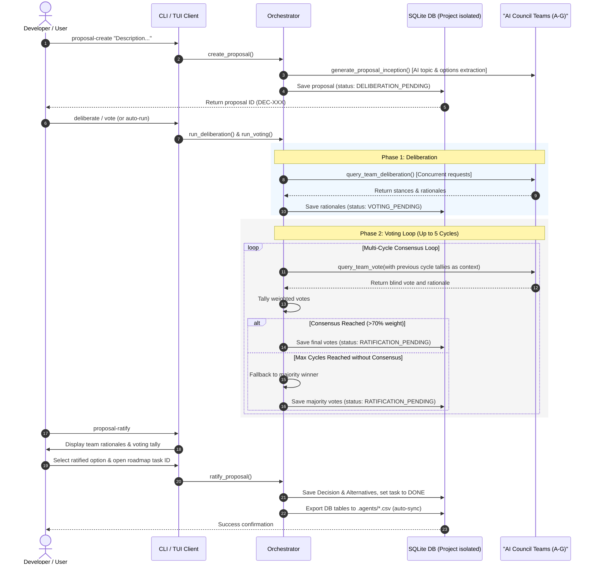

# Council Manager

**v0.9.1** — A Python-based, multi-team AI project governance orchestrator. Council Manager enables collaborative decision-making, blind voting, structured project audits, and real-time monitoring across multiple isolated workspaces.

See [CHANGELOG.md](./CHANGELOG.md) for version release details.

---

## 🚀 Quick Start: Installation & Setup

Ensure you have [uv](https://github.com/astral-sh/uv) installed in your environment.

1. **Install dependencies**:
   ```bash
   uv sync
   ```

2. **Configure Environment Variables**:
   Copy `.env.example` to `.env` and set your API key:
   ```bash
   cp .env.example .env
   ```
   In `.env`:
   ```env
   GEMINI_API_KEY=your-api-key-here
   ```

   *(Optional)* To use a local Ollama model (working offline without API quotas):
   ```env
   LLM_PROVIDER=ollama
   LLM_API_BASE=http://localhost:11434/v1
   LLM_MODEL=qwen3:8b
   ```

---

## 🤖 Agent Quickstart: How AI Agents Interact with Council Manager

AI Agents operating in this workspace interact with project governance exclusively via the official `council-manager` CLI tools:

```bash
# 1. Retrieve token-optimized workspace context (Teams, Decisions, Roadmap)
uv run council-manager get-context -w .

# 2. View active council teams and specialties
uv run council-manager show-teams -w .

# 3. Create a proposal and trigger Phase 1 Deliberation across council teams
uv run council-manager proposal-create "PROPOSAL: My feature description" -w . --deliberate

# 4. Trigger Phase 2 Consensus Voting loop
uv run council-manager vote -w .

# 5. Interactively review team rationales and ratify the decision
uv run council-manager proposal-ratify -w .

# 6. Add or update versioned roadmap tasks (syncs SQLite & roadmap.csv)
uv run council-manager roadmap-update -w . --add --phase 6 --task-name "New Feature" --version 0.9.2 --status TODO
```

---

## 🛠️ Developer Commands & Quick Reference

### Running Tests
```bash
uv run pytest
```

### Terminal Dashboard (TUI)
```bash
uv run council-manager dashboard
```

### Web UI Dashboard & API Server
```bash
uv run council-manager start-server --port 8000
# Open browser: http://127.0.0.1:8000/dashboard
```

### Inspection Commands
```bash
uv run council-manager show-roadmap -w .
uv run council-manager show-decisions -w .
uv run council-manager show-audits -w .
```

---

## 🏗️ Architecture & Detailed System Reference

### Architecture Overview

The system is built around a decoupled **Ports & Adapters (Hexagonal)** architecture, keeping configuration, database engines, orchestration, and user interfaces separated by explicit input/output boundaries.

*   **Subsystem & Component Boundaries**: Detailed in [use_case_planning.md](file:///C:/Users/sulig/.gemini/antigravity-cli/brain/3ee7a652-e3b9-4285-aa73-cc8ce7ebaa96/use_case_planning.md).
*   **Use Cases Diagram**: [use_cases.puml](file:///B:/projects/council_manager/uml/use_cases.puml).
*   **Component Diagram**: [components.puml](file:///B:/projects/council_manager/uml/components.puml).

### Governance Orchestration Lifecycle



---

### Python API Integration

#### 1. Database Session Management
The database layer isolates data per workspace by creating a dedicated SQLite file inside `~/.gemini/council_manager/governance_<slug>.db`.

```python
from pathlib import Path
from council_manager.db import db_manager, Project

workspace_path = Path("B:/projects/council_manager")
session = db_manager.get_session(workspace_path)
try:
    project = session.query(Project).filter_by(id="council_manager").first()
    print(f"Project Name: {project.name if project else 'Not Found'}")
finally:
    session.close()
    db_manager.close_all()
```

#### 2. CSV Import/Export Migration
```python
from pathlib import Path
from council_manager.db import import_csv_to_db, export_db_to_csv

workspace_path = Path("B:/projects/council_manager")
import_csv_to_db(workspace_path, "council_manager")
export_db_to_csv(workspace_path, "council_manager")
```

---

### FastAPI API Backend & Web UI Server

The orchestrator includes a FastAPI backend server supporting multi-tenant database routing and optional API key security.

*   `GET /health`: Health check endpoint.
*   `GET /dashboard`: Real-time browser UI dashboard.
*   `GET /proposals` / `POST /proposals`: Query and create proposals.
*   `POST /proposals/{id}/deliberate` & `/vote`: Queue background worker tasks.
*   `WS /ws/workspace`: Real-time WebSocket event stream for background task progress.

---

### Project Milestones & Development Roadmap

See [.agents/roadmap.csv](file:///B:/projects/council_manager/.agents/roadmap.csv) for the full versioned task log.

*   **Phase 1: Database & Persistence Layer** ✅ (SQLite, Project Isolation, CSV Import/Export)
*   **Phase 2: Deliberation & Voting Core** ✅ (Multi-Team Prompter, Consensus Loop, Task Queue)
*   **Phase 3: APIs & User Interface** ✅ (FastAPI Backend, Terminal UI TUI, Real-time Web Dashboard)
*   **Phase 4: Onboarding & Audits** ✅ (Automated Project Inception, Decision Ratification)
*   **Phase 5: Agent Skills Adapter** ✅ (Local Skill Generators & Workspace Integration)
*   **Phase 6: Roadmap Governance & Enforcement** 🚧 (`roadmap-update`, `get-context`, Runtime Oversight Gates)
